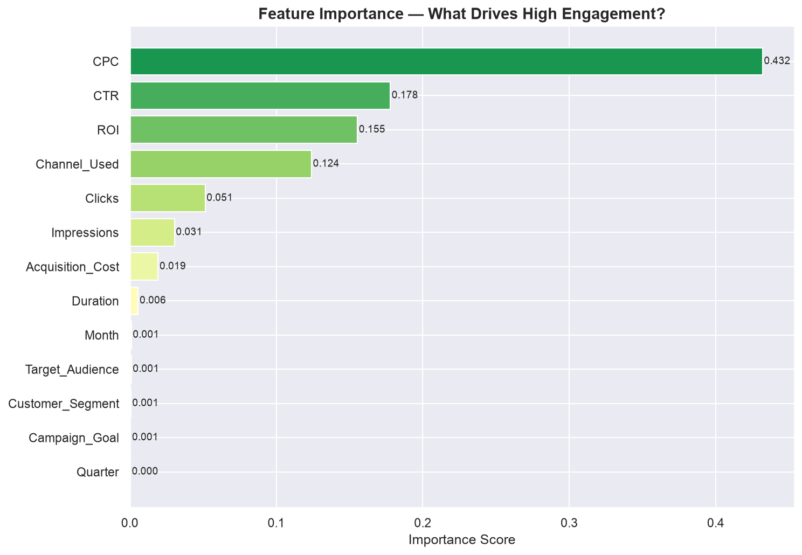

# Social Media Marketing Analytics + Engagement Predictor

End-to-end data science project analysing 300,000 social media ad campaigns 
across Facebook, Instagram, Pinterest and Twitter — with a machine learning 
model that predicts campaign engagement before launch.

## Dashboard Preview




## The Business Problem

Marketing teams spend millions on social media campaigns with no way to predict 
performance before launch. This project answers two questions:

1. **Which platform, audience, and strategy drives the best ROI?**
2. **Can we predict whether a campaign will have high engagement before spending a dollar?**

## Key Findings

###  Pinterest dramatically underperforms
| Metric | Pinterest | Other Platforms |
|---|---|---|
| Average ROI | 0.72 | 4.00 |
| Avg Engagement Score | 1.0 | 5.5 |
| Revenue per Campaign | $5,567 | $31,000 |

**Recommendation:** Reallocate Pinterest budget to Facebook, Instagram, or Twitter.

###  CPC is the #1 predictor of engagement
Feature importance from the Random Forest model:
- CPC (Cost Per Click): **43.2%** importance
- CTR (Click Through Rate): **17.8%** importance  
- ROI: **15.5%** importance
- Channel Used: **12.4%** importance

Efficiency metrics matter more than volume. A cheap, well-targeted ad 
outperforms an expensive broadly-targeted one every time.

###  ML Model can screen campaigns before launch
- **ROC-AUC: 0.728** — significantly better than random guessing
- Instagram campaign (Women 25-34, Fashion, $5k): **59% high engagement probability**
- Pinterest campaign (Men 45-60, Tech, $12k): **6.4% high engagement probability**

## Tech Stack

| Layer | Technology |
|---|---|
| Data manipulation | Python, pandas, numpy |
| Visualisation | matplotlib, seaborn |
| Machine learning | scikit-learn, Random Forest |
| Environment | Jupyter Notebook |
| Data scale | 300,000 rows, 16 features |

## Project Structure

```
social-media-analytics/
├── social_media_analysis.ipynb  # Full analysis notebook
├── platform_comparison.png      # Platform performance charts
├── pinterest_vs_others.png      # Key finding visualisation
├── model_evaluation.png         # Confusion matrix + ROC curve
├── feature_importance.png       # What drives engagement
├── monthly_trends.png           # Campaign performance over time
└── README.md
```

## Methodology

### Feature Engineering
Created 5 derived marketing metrics from raw data:
- **CTR** = Clicks / Impressions × 100
- **CPC** = Acquisition Cost / Clicks
- **CPM** = Acquisition Cost / Impressions × 1000
- **Revenue** = ROI × Acquisition Cost
- **High Engagement** = Engagement Score > median (binary target)

### ML Pipeline
1. Label encoded categorical features (platform, audience, goal, duration, segment)
2. 80/20 train/test split with stratification
3. Random Forest (100 trees, max depth 10, balanced class weights)
4. Evaluated with classification report + ROC-AUC
5. Threshold tuning for business use case optimisation

### Dataset Note
Dataset shows characteristics of synthetic generation (uniform conversion 
rates across audiences). Real-world application would show stronger signals. 
Pinterest underperformance remains a robust finding across all metrics.

## How to Run

```bash
git clone https://github.com/sanda0620/social-media-analytics.git
cd social-media-analytics
pip install pandas numpy matplotlib seaborn scikit-learn jupyter
jupyter notebook social_media_analysis.ipynb
```